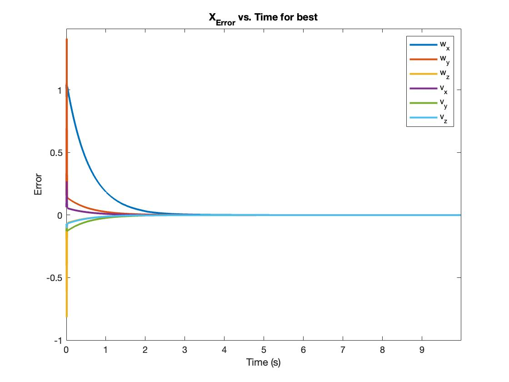
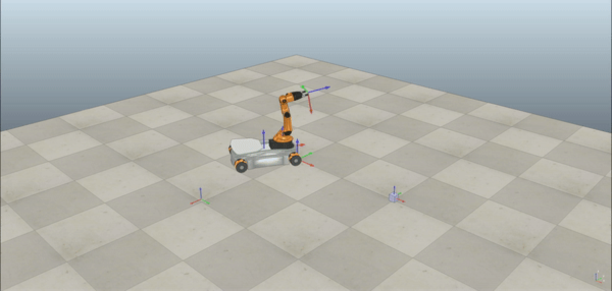

# Robot-Motion-Control
Implemented trajectory generation and motion control on a KUKA youBot using coppeliaSim simulation package. The task was to pick up a cube and place it at a desired location

## Functions
1. **TrajectoryGenerator**: Given a sequence of poses/locations in terms of 4x4 SE(3) matrices, return the trajectory between them
2. **NextState**: Given current state and inputs, predict the next state
3. **FeedbackControl**: given the actual, desired and future state, return the control input to minimize error
4. **FeedbackControlOvershoot**: FeedbackControl script, but for the overshoot case (no feedforward component, only PI controller)

## Main body scripts
1. **Final_Wrapper_Best**: Wrapper script for the best case control scenario 

| Image                                                                                                                                            | Video                                                                                                                                            |
|--------------------------------------------------------------------------------------------------------------------------------------------------|--------------------------------------------------------------------------------------------------------------------------------------------------|
|  |  |

| Error Plot                      | Motion Video                 |
|---------------------------------|------------------------------|
|  |  |

2. **Final_Wrapper_Overshoot**: Wrapper scipt for the oversahoot case, where gain constants were suboptimal

| Image                                                                                                                                            | Video                                                                                                                                            |
|--------------------------------------------------------------------------------------------------------------------------------------------------|--------------------------------------------------------------------------------------------------------------------------------------------------|
|  |  |

3. **Final_Wrapper_newtask**: Wrapper script for the best case scenario for a new case, with new cube pick/place positions

| Image                                                                                                                                            | Video                                                                                                                                            |
|--------------------------------------------------------------------------------------------------------------------------------------------------|--------------------------------------------------------------------------------------------------------------------------------------------------|
|  |  |
